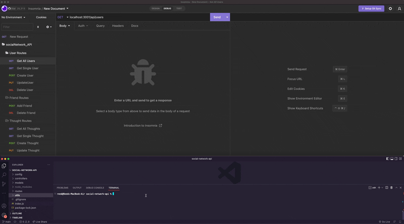

# Social Network API

## Description

The Social network API application provides the basic backend set up for a social network that allows users to add friends to a friends list, create posts (or 'thoughts'), react to posts and edit/delete posts, reactions, and their friends list.

Developing this backend provided an oppertunity for me to learn more about NoSQL databases (specifically mongoDB), the mongoose ORM, and how those tools work with routes and can be displayed via JSON. 

## Installation

To work on this application on your own machine clone down this repo to your machine and open it in your favorite code editor. And be sure to install all packages and depedencies with 'npm i' in the terminal before running the application. 

A few callouts: 
- This application uses mongoDB so you will want to be sure you have that installed and it would be likely be helpful to utalize the mongo compass GUI to review and manage your databases. 
- It may also be handy to install Insomnia or a similar software to work with the routes. 

## Usage

Once active, the application allows users to:
- Add new users 
- Pull all information of a single or all users 
- Update user information
- Delete user information
- Add or remove other user's from a friend's list
- Create new posts (or 'thoughts')
- Edit or delete thoughts
- Add or remove reactions to specific thoughts 

To see the application in action, you can review the walkthrough gif below or click this [walkthough](https://drive.google.com/file/d/1TU8EBkMx12SzI6GmDykT8eF6IBs3BYU6/view?usp=sharing ) link to seethe full high quality video. 
    

    

## Credits

This project utalizes: 
- MongoDB
- Mongoose
- Nodemon

I also used MongoDB Compass to help manage my NoSQL databases. 

